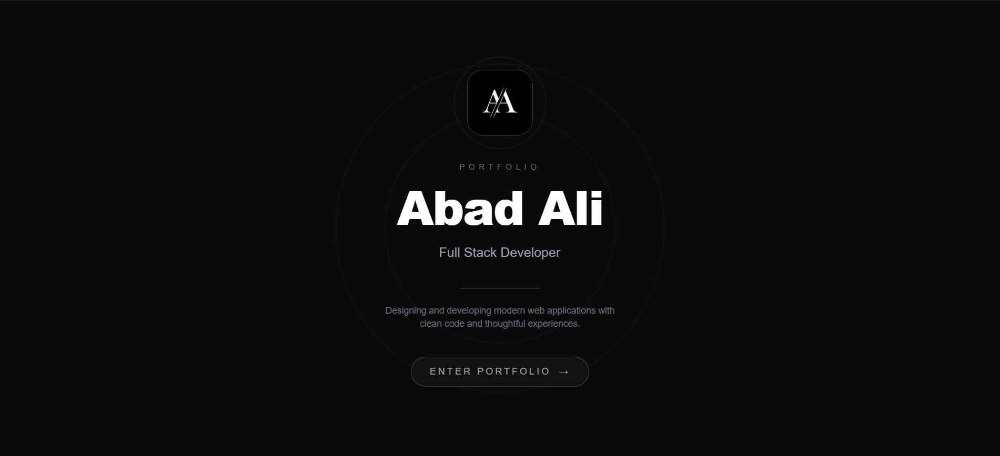
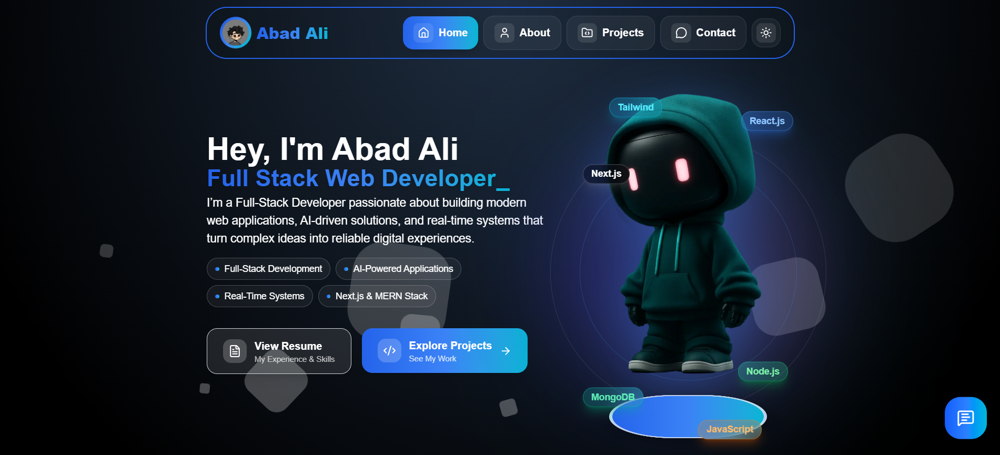
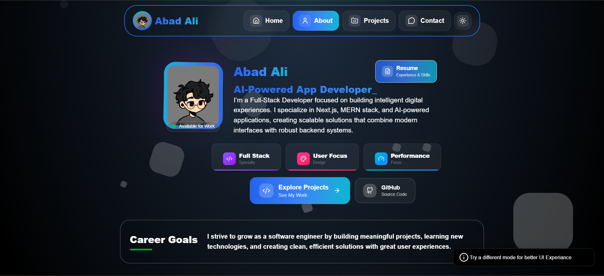
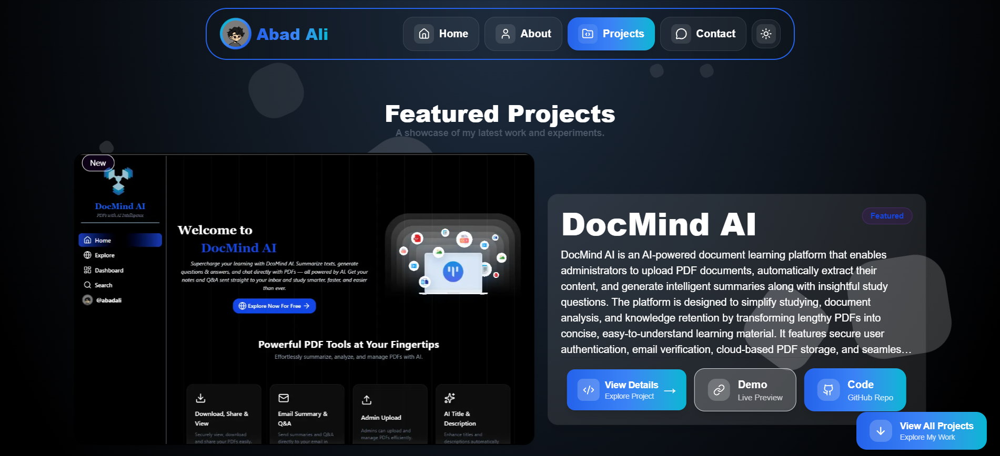
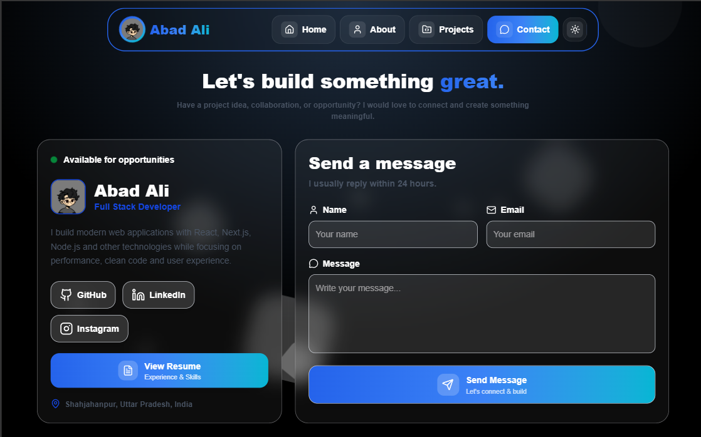
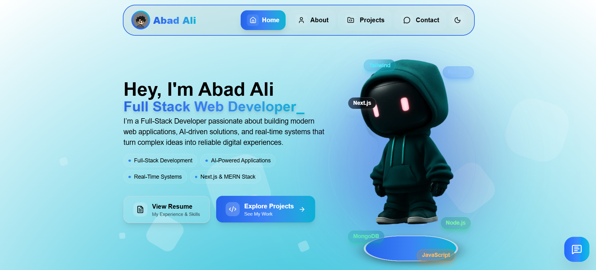
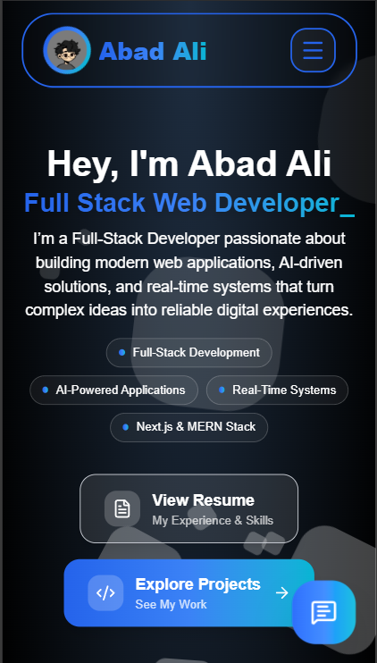
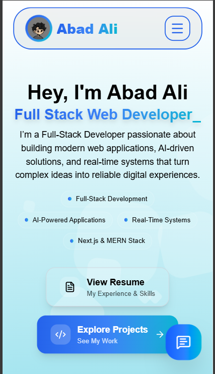

# Sandeep Pati Portfolio

<p align="center">


<br/>

<div align='center'>
  

  

  

  
</div>

</p>

A modern, responsive, and SEO-optimized developer portfolio built with **Next.js 16** and **React 19** using the **App Router**. This portfolio showcases my projects, technical skills, certifications, education, and provides an easy way for visitors to get in touch through an integrated contact form.

The application is designed with a strong focus on performance, accessibility, user experience, and search engine optimization. It includes smooth animations, dynamic routing, dark/light theme support, and is deployed on Vercel.

---

## Live Demo

<p align="center">
  <a href="https://sandeep-pati.vercel.app">
    
  </a>
  <a href="https://github.com/sandeep-pati-dev/portfolio">
    
  </a>
  <a href="https://www.linkedin.com/in/sandeep-pati-537ba030b/">
    
  </a>
</p>

---

## Preview

<details>
<summary><b>Click to view screenshots</b></summary>

<br>

<div align="center">



<br />



<br />



<br />



<br />



<br />



<table>
<tr>
<td>

</td>
<td>

</td>
</tr>
</table>

</details>

---

## Project Highlights

-  Built with Next.js 16 App Router
-  Dark and light theme support
-  SEO optimized with Metadata API, sitemap, and Open Graph
-  Fully responsive across desktop, tablet, and mobile devices
-  Smooth animations using Framer Motion
-  Functional contact form integration
-  Automatic deployment through Vercel

---

## Table of Contents

- [Sandeep Pati Portfolio](#sandeep-pati-portfolio)
- [Preview](#preview)
- [Project Highlights](#project-highlights)
- [Introduction](#introduction)
- [Features](#features)
- [Technologies Used](#technologies-used)
- [Project Structure](#project-structure)
- [Getting Started](#getting-started)
- [Installation](#installation)
- [Environment Variables](#environment-variables)
- [Available Scripts](#available-scripts)
- [SEO Features](#seo-features)
- [Deployment](#deployment)
- [Future Improvements](#future-improvements)
- [Author](#author)
- [Usage Policy](#usage-policy)

---

## Introduction

This portfolio serves as my personal website where I showcase my professional profile, technical skills, projects, certifications, and educational background.

It is built using the latest version of Next.js with the App Router architecture to deliver fast page loads, excellent SEO, and a seamless user experience. Visitors can browse my projects, learn more about me, and contact me directly through the integrated EmailJS contact form.

---

## Features

* Modern responsive user interface
* Built with Next.js App Router
* Dark and Light theme support
* Technology-based project filtering (All Projects, Next.js, React.js)
* Fully mobile responsive
* Dynamic project pages
* Interactive project showcase
* Contact form powered by EmailJS with React Hook Form and Zod validation
* Smooth page transitions and animations powered by Framer Motion
* SEO optimized pages
* Open Graph support
* robots.txt and sitemap.xml
* Custom 404 page
* Optimized for performance and accessibility
* Deployed on Vercel

---

## Technologies Used

## Framework

* Next.js 16
* React 19

## Styling

* CSS Modules
* Tailwind CSS
* tailwind-merge
* clsx
* class-variance-authority

## UI Components

* Radix UI
* Lucide React
* React Icons
* Swiper
* Sonner
* Typewriter Effect

## Animations

* Framer Motion

## Forms & Validation

* React Hook Form
* Zod
* @hookform/resolvers

## Email Service

* EmailJS

## Deployment

* Vercel

---

## Project Structure

```text
sandeep-portfolio
│
├── app
│   ├── about
│   │   ├── AboutClient.js
│   │   └── page.js
│   │
│   ├── contact
│   │   ├── ContactClient.js
│   │   └── page.js
│   │
│   ├── projects
│   │   ├── [projectname]
│   │   │   ├── ProjectnameClient.js
│   │   │   └── page.js
│   │   │
│   │   ├── all
│   │   │   └── page.js
│   │   │
│   │   ├── ProjectsClient.js
│   │   ├── projectsData.js
│   │   └── page.js
│   │
│   ├── HomeClient.js
│   ├── favicon.ico
│   ├── globals.css
│   ├── layout.js
│   ├── not-found.js
│   └── page.js
│
├── components
│   ├── ui
│   ├── AllProjects.jsx
│   ├── AnimatedBackground.module.css
│   ├── Certifications.jsx
│   ├── EducationSection.jsx
│   ├── Footer.jsx
│   ├── Navbar.jsx
│   ├── RouteTransition.jsx
│   ├── SkillsCarousel.jsx
│   ├── ThemeProvider.jsx
│   └── ThemeWrapper.jsx
│
├── lib
│   └── utils.js
│
├── public
│   ├── certificates
│   ├── projects
│   ├── screenshots
│   ├── avatar.png
│   ├── bg.webp
│   ├── logo.png
│   ├── resume.pdf
│   ├── sitemap.xml
│   ├── robots.txt
│   └── opengraph images
│
├── .gitignore
├── components.json
├── eslint.config.mjs
├── jsconfig.json
├── next.config.mjs
├── package.json
└── README.md
```

---

## Getting Started

Follow the steps below to run the project locally.

## 1. Clone the Repository

```bash
git clone https://github.com/sandeep-pati-dev/portfolio.git
```

## 2. Navigate to the Project Directory

```bash
cd sandeep-portfolio
```

## 3. Install Dependencies

```bash
npm install
```

## 4. Configure Environment Variables

Create a `.env.local` file in the project root.

```env
# Gemini API Key (For AI Portfolio Assistant Chatbot)
GEMINI_API_KEY=your_gemini_api_key

# EmailJS Configuration (For contact form)
NEXT_PUBLIC_SERVICE_ID=your_service_id
NEXT_PUBLIC_TEMPLATE_ID=your_template_id
NEXT_PUBLIC_PUBLIC_KEY=your_public_key
```

## 5. Start the Development Server

```bash
npm run dev
```

Visit

```text
http://localhost:3000
```

---

## Available Scripts

| Command         | Description                           |
| --------------- | ------------------------------------- |
| `npm run dev`   | Starts the development server         |
| `npm run build` | Builds the application for production |
| `npm run start` | Starts the production server          |
| `npm run lint`  | Runs ESLint                           |

---

## SEO Features

The portfolio is optimized for search engines and social sharing.

* Metadata API
* Dynamic page metadata
* Open Graph images
* robots.txt
* sitemap.xml
* Semantic HTML
* Fast page loading
* Responsive layout
* Optimized images
* Search engine indexing

The portfolio includes SEO optimizations to improve discoverability through search engines.

---

## Deployment

The application is deployed on **Vercel** with automatic deployments connected to the GitHub repository.

Live Website:

<p align="left">
  <a href="https://sandeep-pati.vercel.app/" target="_blank">
    
  </a>
</p>

---

## Future Improvements

Some features planned for future updates include:

* Blog section for sharing technical articles and tutorials
* Project search functionality
* Project categories with multiple filter combinations
* Multi-language support (i18n)
* Admin dashboard for managing project content
* CMS integration (Sanity, Contentful, or Strapi)
* Visitor analytics dashboard
* Enhanced project case studies with detailed development process
* Unit and integration testing
* Progressive Web App (PWA) support


---

## Author

**Sandeep Pati**
Full Stack Developer

Passionate about building modern, scalable, and user-friendly web applications using the latest technologies.

<p align="left">
  <a href="https://sandeep-pati.vercel.app/" target="_blank">
    
  </a>

  <a href="https://github.com/sandeep-pati-dev" target="_blank">
    
  </a>

  <a href="https://www.linkedin.com/in/sandeep-pati-537ba030b/" target="_blank">
    
  </a>

  <a href="mailto:sandeeppati69@gmail.com">
    
  </a>
</p>


---

## Usage Policy

This portfolio was designed and developed by **Sandeep Pati**.

You are welcome to explore the source code, learn from the implementation, and use it as a reference for your own projects.

Please do not copy, redistribute, or reuse the design, branding, images, personal content, or significant portions of the source code without permission.
